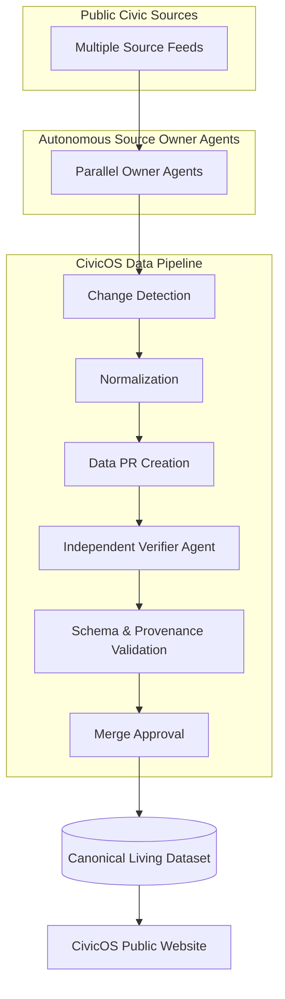
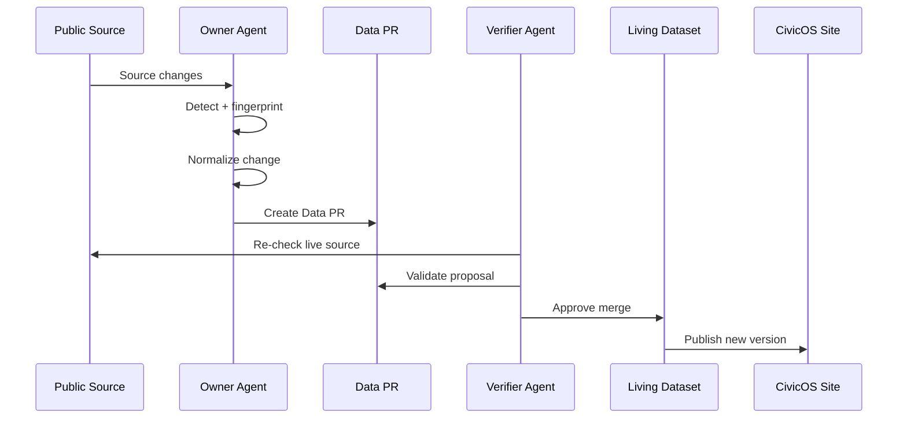

<div align="center">

# CivicOS

### The civic dataset that refuses to go stale.

**Static dashboards are dead. CivicOS maintains itself.**


[Live Demo](#) • [GitHub](https://github.com/priteshvirat24/CivicOS) • [Demo Video](https://youtu.be/YpnATqtQqis)

CivicOS monitors public civic data using autonomous source-owner agents. When reality changes, an agent detects it, creates a Data PR, an independent verifier checks it, and the canonical dataset autonomously updates itself.

</div>

---

## 2. The Problem

Public civic data changes constantly. Policies are updated, income limits shift, and requirements evolve.

Traditional dashboards usually follow this broken lifecycle:

```text
Source changes
      ↓
Someone notices
      ↓
Someone manually updates data
      ↓
Someone verifies it
      ↓
Dashboard redeployed
```

This creates a systemic failure point:
* Stale information
* Manual maintenance burdens
* Delayed updates
* Inconsistent data
* Poor provenance
* Massive operational overhead

> **The problem isn't that civic data is unavailable. The problem is that most systems aren't designed to notice when reality changes.**

---

## 3. The CivicOS Solution

```text
                 CIVICOS

        PUBLIC CIVIC SOURCES
       /   /   /   /   /   \
      ↓   ↓   ↓   ↓   ↓   ↓
   OWNER AGENTS OPERATING IN PARALLEL
              ↓
        CHANGE DETECTION
              ↓
           DATA PR
              ↓
       VERIFIER AGENT
              ↓
     SOURCE + SCHEMA + PROVENANCE
              ↓
           VERIFIED
              ↓
            MERGE
              ↓
       CANONICAL DATASET
              ↓
        PUBLIC CIVIC SITE
```

CivicOS does not simply scrape data. It continuously maintains the dataset. By assigning autonomous AI agents to own and watch individual public sources, the dataset heals and updates itself without manual human intervention.

---

## 4. Architecture



### Source Adapters
Each public source is polled and parsed individually. Because civic data can be hidden in PDFs, dynamic HTML, or undocumented APIs, source adapters fetch the raw reality.

### Source Owner Agents
An autonomous agent is uniquely assigned to own one specific source. Its only job is to understand that source, track its state, and notice if reality has shifted.

### Change Detection
When an agent pulls new data, it compares semantic fingerprints and data diffs. If the underlying meaning or values have changed (e.g., an income limit increased), it flags a meaningful change.

### Data PR
Instead of silently mutating the live production database, the agent creates a **Data PR**. This proposes the exact change, including the previous value, new value, and source evidence.

### Verifier Agent
An independent AI agent takes the Data PR and rigorously checks it. It cross-references the live source, ensures the schema is strictly adhered to, and validates the provenance trail.

### Canonical Dataset
Only strictly verified Data PRs are merged into the Canonical Dataset. This ensures high-integrity, version-controlled civic data.

### Public Website
The React/Next.js frontend connects directly to the canonical dataset, providing users with real-time, interactive, and verifiable civic information.

---

## 5. Why Multi-Agent Architecture?

We specifically engineered CivicOS as a multi-agent system rather than a single massive script.

```text
Source A → Agent A
Source B → Agent B
Source C → Agent C
...
Source H → Agent H
```

Each civic source has:
* different structural layouts
* different update frequencies (daily vs. annually)
* different failure modes
* different normalization requirements

Source ownership creates genuine, resilient parallelism. If one city's website goes down or changes its HTML structure, we benefit from complete fault isolation:

```text
Agent 04 fails
     ↓
Agent 01 continues
Agent 02 continues
Agent 03 continues
Agent 05 continues
Agent 06 continues
Agent 07 continues
Agent 08 continues
```

This is **real autonomous ownership**, not just one cron job pretending to be multiple agents.

---

## 6. The Living Dataset Lifecycle



1. **Source Changes:** A government entity updates a policy.
2. **Detect & Normalize:** The owner agent notices the shift, normalizes the unstructured data into our unified schema.
3. **Data PR:** A formal proposal to change the dataset is created.
4. **Verification:** The verifier agent independently checks the live source to confirm the owner agent didn't hallucinate.
5. **Merge & Publish:** The change is approved, merged, and instantly reflected on the CivicOS site.

---

## 7. Data PRs

CivicOS does not silently mutate production civic data. 

```text
Old Data
   ↓
Detected Change
   ↓
Data PR
   ↓
Verification
   ↓
Approved
   ↓
Merged
```

A Data PR contains exactly what changed and why:
* source ID & agent ID
* previous value & proposed value
* data diff
* source evidence (URL/snapshot)
* schema version
* provenance chain
* verification result
* dataset version

This strict boundary prevents AI hallucinations from instantly corrupting public data and creates a perfect audit trail.

---

## 8. Verification

```text
DATA PR
   ↓
SOURCE RECHECK
   ↓
SCHEMA VALID
   ↓
VALUE MATCH
   ↓
PROVENANCE VALID
   ↓
SEMANTIC CHECK
   ↓
VERIFIED
```

The source-owner agent proposes the change. The verifier independently checks it. This prevents an incorrect agent interpretation from directly reaching production. The verifier is mandated to reject invalid, hallucinated, or unprovable proposals.

---

## 9. Failure Handling

```text
SOURCE FAILURE
      ↓
RETRY
      ↓
IF STILL FAILING
      ↓
MARK SOURCE DEGRADED
      ↓
KEEP LAST KNOWN GOOD DATA
```

When a source times out, a schema suddenly changes, or malformed data appears, the responsible agent handles the failure gracefully. It marks the source as degraded.

**A broken source must not corrupt the last known good dataset.** The rest of CivicOS continues operating normally.

---

## 10. Provenance

CivicOS easily answers: > *"Where did this value come from?"*

```text
Record
 ↓
Source
 ↓
Observation
 ↓
Owner Agent
 ↓
Data PR
 ↓
Verifier
 ↓
Dataset Version
```

Users can trace any value on the frontend back to its exact source URL, the agent that observed it, and the verification history that approved it.

---

## 11. The 30-Second Demo

We built a dedicated "Judge Mode" to demonstrate the entire lifecycle in a cinematic, automated 30-second presentation.

```text
0-3s    STATIC DASHBOARDS ARE DEAD
3-6s    CivicOS starts watching sources
6-10s   Agents monitor independent sources
10-14s  One source changes
14-18s  Owner agent detects change
18-22s  Data PR enters verification
22-25s  Verifier approves
25-28s  Dataset version changes
28-30s  PUBLIC DATA UPDATES
```

> **Reality changed. CivicOS noticed.**

This demo visually communicates the autonomous lifecycle seamlessly using React Three Fiber.

---

## 12. Frontend

We built an immersive, hackathon-winning frontend experience using **Next.js**, **React**, and **TypeScript**.
* **Interactive 3D CivicOS Architecture:** Built with Three.js and React Three Fiber to visualize agents orbiting the canonical core.
* **Live Activity Feed & Data PR Visualization:** Real-time UI showing agent actions and diffs.
* **Civic Dataset Explorer:** Clean editorial tables (not generic admin dashboards).
* **Framer Motion Transitions:** Smooth, scroll-linked animations and typography reveals.
* **Responsive Design:** Operates beautifully across devices.

---

## 13. Tech Stack

| Technology | Purpose |
|------------|---------|
| **Next.js & React** | Frontend framework for building the cinematic user interface |
| **TypeScript** | Strict type-safety across both the UI and data payloads |
| **Tailwind CSS** | Utility-first styling and custom design system |
| **Framer Motion** | Advanced scroll and layout animations |
| **Three.js & React Three Fiber** | 3D rendering of the autonomous multi-agent architecture |
| **Python & FastAPI** | High-performance, asynchronous backend API and orchestrator |
| **SQLAlchemy & SQLite** | Relational database handling agent states and the canonical dataset |
| **LLMs (AI)** | Agent brains for detecting semantic changes and verifying source data |

---

## 14. Project Structure

```text
civicos/
├── frontend/             # Next.js web application
│   ├── src/components/   # React components (3D, UI, Judge Mode)
│   └── src/app/          # Next.js App Router pages
├── backend/              # FastAPI Python server
│   ├── app/api/          # REST endpoints
│   ├── app/agents/       # Autonomous owner & verifier agents
│   ├── app/db/           # SQLAlchemy models and database setup
│   └── app/services/     # Core business logic
└── README.md
```

---

## 15. Getting Started

### Prerequisites
* Node.js (v18+)
* Python 3.11+
* npm or pnpm

### Environment Variables
Copy `.env.example` to `.env` in both the frontend and backend (if applicable). Do not expose real API keys.

### Backend Setup
```bash
cd backend
python -m venv venv
source venv/bin/activate
pip install -r requirements.txt

# Start the FastAPI server (runs on port 8000)
uvicorn app.main:app --reload
```
*(Note: Database initialization is currently a TODO in the setup script, ensure `civicos.db` is initialized via SQLAlchemy).*

### Frontend Setup
```bash
cd frontend
npm install

# Start the Next.js dev server (runs on port 3000)
npm run dev
```

Visit `http://localhost:3000` to experience CivicOS.

---

## 16. Environment Variables

| Variable | Purpose | Required |
| -------- | ------- | -------- |
| `OPENAI_API_KEY` | Used by agents for semantic change detection and verification | Yes (Backend) |
| `NEXT_PUBLIC_API_URL` | Connects frontend to the FastAPI backend | Yes (Frontend) |

---

## 17. Testing

CivicOS focuses on ensuring the autonomous lifecycle is safe.

```text
SOURCE CHANGES
      ↓
AGENT DETECTS
      ↓
DATA PR
      ↓
VERIFIER APPROVES
      ↓
DATASET UPDATES
```

And crucially, the rejection case must be strictly enforced:
```text
INVALID PROPOSAL
      ↓
VERIFIER REJECTS
      ↓
PRODUCTION UNCHANGED
```

Testing strategies include source adapter mocks, Data PR validation checks, and isolated agent verification tests.

---

## 18. Security and Data Integrity

* **Source Verification:** The verifier agent must re-check the live source; it cannot blindly trust the owner agent's proposal.
* **Failure Isolation:** One crashing agent adapter does not impact the rest of the dataset.
* **Safe Merging:** Direct writes to the canonical dataset are restricted strictly to the verification pipeline.
* **Audit History:** Every change maintains a perfect provenance record via the Data PR system.

---

## 19. Challenges

* **Heterogeneous Public Sources:** Government data is notoriously messy. Normalizing arbitrary PDFs, HTML tables, and outdated APIs into a unified schema required flexible agent parsing.
* **Detecting Meaningful Changes:** Differentiating between a website's cosmetic HTML change and an actual policy/data change is difficult. We had to rely on semantic diffing rather than naive scraping.
* **Autonomous Verification:** Ensuring the Verifier Agent was strict enough to prevent AI hallucinations, but smart enough to understand formatting changes, required careful prompt engineering and logic gates.
* **3D Visualizations:** Integrating complex React Three Fiber components without breaking the aesthetic or clipping on smaller screens.

---

## 20. What We Learned

> **Autonomy without verification is not enough for civic data.**

> **The hard problem is not fetching data. It is deciding when a change is real, meaningful, trustworthy, and safe to publish.**

---

## 21. Future Vision

* **Broader Datasets:** Expand from 8 sources to monitor hundreds of civic sources across multiple municipalities.
* **Public API:** Build an open GraphQL API so developers can build apps on top of the dataset without worrying about stale data.
* **Automatic Schema Adaptation:** Allow agents to propose schema upgrades when public sources fundamentally change their structure.
* **Source Reliability Scoring:** Track which public sources are most frequently updated or degraded over time.

*(Note: These are planned expansions, not currently implemented features).*

---

## 22. Why CivicOS?

```text
Traditional Dashboard
Source → Manual Update → Deploy

CivicOS
Source → Agent → Data PR → Verify → Merge → Live Dataset
```

**The dashboard is no longer the thing that needs maintenance.**

**The dataset maintains itself.**

---

## 23. Demo and Links

**Live Demo:** [CivicOS Demo](#)

**GitHub:** [Source Code](https://github.com/priteshvirat24/CivicOS)

**Video:** [30-Second Demo](https://youtu.be/YpnATqtQqis)

---

## 24. Screenshots

*(Replace placeholders with actual image paths if added to the repository)*

* [Hero / 3D Architecture](#)
* [Judge Mode Demo](#)
* [Data PR Verification](#)
* [Live Dataset & Provenance](#)

---

## 25. License

Licensing for this project has not yet been specified. Please refer to the repository owner.
